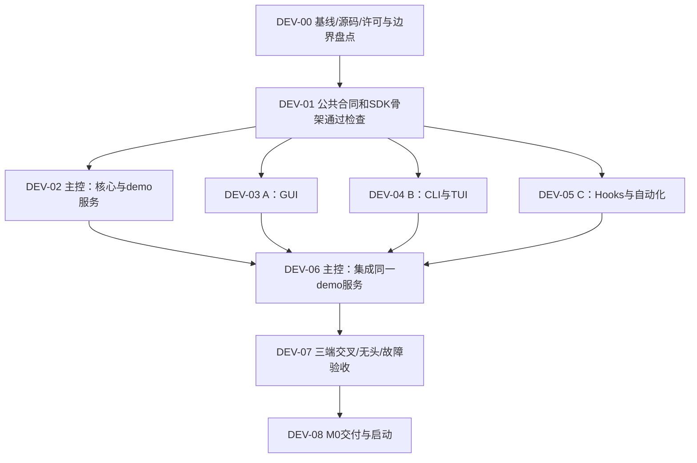

# 开发任务并发编排

版本：v2.3 编排增补。状态：待执行的开发组织方案，不表示已经启动开发 Agent。

本文件编排“开发巴别塔”的工作，产品内部 Pi 任务的状态机继续遵循 [主 SPEC](NIMBALYST-DEVELOPMENT-SPEC.md)和[TUI/Hooks 契约](NIMBALYST-TUI-HOOKS-SPEC.md)。两套任务身份和事件命名空间分开，开发 Agent 退出不能把产品任务置为 DONE。

## 1. 默认 1 个主控 + 3 个工作 Agent

主控负责公共合同、核心服务、接口变更和集成。三个工作 Agent 分别负责 GUI、TUI/CLI、Hooks/自动化测试。并发数是上限，缺少已就绪独立任务时不凑数。

| 执行者 | 主要责任 | 默认可写范围，实际路径在 NB-00 锁定 |
|---|---|---|
| 主控/集成 | 合同、SDK骨架、权威服务、持久化、公共守卫、最终集成 | contracts、core、公共 adapters、根清单/lockfile、当前 SPEC/任务清单 |
| A：GUI | Nimbalyst 三栏、原生 Tracker 视图接入、详情、主题/响应式 | Babel GUI组件、明确分配的宿主接缝、GUI测试 |
| B：终端 | CLI JSON/错误码、交互TUI、输入和重连 | cli、tui、终端适配、CLI/PTY测试 |
| C：Hooks/验证 | Hook投递/脚本协议、故障注入、跨端测试脚本 | hooks、Hook测试、tests/automation；不直接改核心状态机 |

路径是职责示例，不是已存在的上游目录。原生 Tracker 保存路由涉及多个文件，主控必须指定唯一拥有者；不能让 GUI 与核心 Agent 同时各改一套路由。共享 fixtures/Schema 的写入归主控，其他 Agent 提交变更建议。

## 2. 依赖图：合同先行，主体并发，集成收口



DEV-00 的源码阅读可并行：主控看核心/数据，A看宿主布局，B看无头/TUI接缝，C看事件/测试。各自只读或写独立研究记录，主控汇总。

DEV-01 必须先产出可导入的类型/客户端骨架、固定fixture、命令/事件正反例、错误语义、公共接口测试和文件归属清单。GUI、终端、Hooks 用这个合同开发；允许明确标记的合同测试替身，不能各自猜 API 或建立长期独立的任务模型。

DEV-02～05 可同时推进。B先完成 CLI 的一个纵向场景，再在同一客户端之上做TUI；A和C不必等待整套TUI完成。服务就绪后各分支尽早接真实demo服务，不等全部页面写完再第一次集成。

DEV-06 逐个集成可审查的小提交；DEV-07 的最终验收针对同一个集成提交。各分支通过测试是交接依据，不等于三端合并后已经通过。

## 3. 与 NB 里程碑对应

NB 是交付里程碑，DEV 是可派发工作包。NB-02→03→04 的完成顺序保留，但不意味着必须写完所有 shell 才能开始任一已经具备接口的功能。

| 工作包 | 对应NB | 就绪条件 | 可检查交接物 |
|---|---|---|---|
| DEV-00 | NB-00 | 已有资料及可读源码 | 固定HEAD、dirty清单、许可/构建命令、耦合和路径归属 |
| DEV-01 | NB-01 | DEV-00完成 | 合同版本、SDK骨架、fixture版本、正反例、接口测试 |
| DEV-02 | NB-02/03 | DEV-01完成 | 无图形demo服务、持久身份/守卫/事件与核心测试 |
| DEV-03 | NB-02/03/04 | DEV-01完成 | GUI接入、交互测试、截图、受影响宿主回归 |
| DEV-04 | NB-02/03/04 | DEV-01完成 | CLI结果/错误、TUI操作、PTY记录，接demo服务证据 |
| DEV-05 | NB-03/04 | DEV-01完成 | Hook组件、重复/超时/崩溃测试、跨端验收脚本 |
| DEV-06 | NB-02/03/04集成 | 所依赖的组件补丁可审查、核心服务可用 | 集成提交、迁移/依赖一致性、冒烟和回归结果 |
| DEV-07 | NB-04验收 | DEV-06构建和冒烟通过 | PAR/HEADLESS/CLI/TUI/HOOK/EVIDENCE/LIFE及原验收证据 |
| DEV-08 | M0 | DEV-07必需项通过 | 启动命令、能力矩阵、限制、GUI/TUI体验入口 |

NB-05生产Gateway可以在合同稳定且用户授权该阶段后，与后续客户端工作并行；Worker合同稳定后NB-07也可开发。真实联调仍依赖相关服务与适配器就绪。M0的授权不能自动扩大为接真实账号、设备或部署生产服务。

## 4. 隔离与合并

- 一个可写工作包对应一个分支/独立 worktree，从记录的基线开始。主控维护集成检出；不用多个 Agent 共用一个可写 checkout 或 Git index。
- 每个工作包有自己的端口、demo profile、临时数据、日志和构建输出；不要并发安装依赖到同一 node_modules 或修改同一 lockfile。已有用户数据不作测试数据。
- 根 package/lockfile、公共 Schema、数据库迁移、统一路由和共享 fixture 只允许指定拥有者修改。其他 Agent 在自己的交接记录提出依赖变更，由主控集中处理并通知消费者。
- 接口变化由主控生成合同修订，通知受影响Agent，重跑合同测试；不能一个分支偷偷改字段、另一个分支用旧签名继续猜。
- 工作 Agent 提交前检查差异和自己的测试，给出明确提交/补丁；主控按依赖顺序逐个合入，解决冲突后回归。禁止用重置或覆盖抹掉别人的改动。
- 集成测试与组件隔离测试不同：最终三端必须指向同一个专用集成demo服务和同一fixture，才能证明同源；不能拿三个私有profile的结果冒充三端一致。
- 主控限制同时运行的重型构建/完整测试，默认最多两个，实际以CPU、内存、磁盘压力调整。依赖安装及最终交互验收按共享资源串行；并发Agent数量不等于并发全量构建数量。

## 5. 每次派发的最小任务说明

```text
工作包：DEV-xx / 唯一执行者
目标：一个可验收结果
依赖：已满足项、接口版本与基线提交
读取：相关SPEC章节、Schema、fixture、源码入口
允许修改：明确文件/目录；禁止修改：共享合同/其他Agent文件
隔离：worktree、分支、端口、profile、日志和输出目录
验收：必须执行的测试与真实交互，所需数据
交付：提交/补丁、变更文件、测试命令/结果、截图或日志、未覆盖项
阻塞时：报告依赖/接口冲突，保留工作，不私自换业务模型
```

主控更新任务台账：taskId、owner、dependsOn、contractVersion、worktree、baseCommit、changedPaths、状态、交接提交、证据与阻塞理由。最初可以是 JSON/Markdown，不要求先开发另一个编排平台才能开工。

## 6. 状态与 Hooks 辅助调度

开发台账用 `pending → ready → running → review → integrated → verified`，另有 `blocked/failed/cancelled`。只有依赖满足、文件范围不冲突、资源可用才进入ready；运行失败不会自动宣称完成。

开发编排事件与产品业务事件分开，例如 `development.task.submitted` 只表示补丁已交接。Hook可收集测试报告、通知主控、检查依赖就绪、记录状态；不能因为Agent停止输出或进程退出码0就自动verified，更不能自动发起未经当前阶段授权的真实任务。

交接报告带taskId、attemptId、commit、contractVersion、测试结果及产物路径。主控核对真实提交和报告后集成。重发报告按taskId/attemptId去重；重复通知不重复派发同一可写任务。涉及合并、共享Schema、迁移及最终验收的动作由单一主控串行执行。

并发收益来自独立实现和提前发现接口问题；合同不稳定、文件争用或机器压力过高时降低并发，先解决阻塞。
