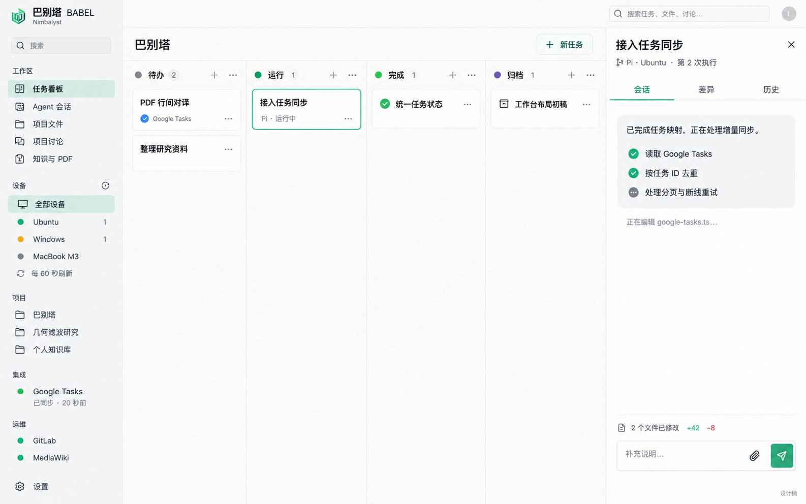

# 巴别塔 × Nimbalyst：GUI / TUI / CLI 工作台与 Hooks 开发 SPEC

版本：v2.3 · 日期：2026-09-14 · 状态：待实施的开发规格。

本文件落实用户确认的 UI v2、原生 Tracker 映射，以及新增能力必须具备 GUI/TUI/CLI 等价业务操作和 Hooks 的要求。Nimbalyst 是桌面宿主；领域核心、终端与自动化入口独立于图形窗口运行。本文不表示已完成改造，也不把独立 Cursor 演示算作 Nimbalyst 验收。旧版完整保留在 [v2.2 存档](reference/v2.2/README.md)。

必须同时实施 [TUI 与 Hooks 契约](NIMBALYST-TUI-HOOKS-SPEC.md)及[功能对照表](CAPABILITY-MATRIX.md)。不允许先把新增业务写死在 GUI 回调中，再把终端与自动化当作未来可选附件。

必须同时满足 [Trackers 一一映射与源码审计](NIMBALYST-TRACKER-MAPPING.md)。本次补充明确：两个面板共用原生 TrackerRecord 身份与 TrackerDataSource；Task 仅是执行 API 视图，不建立第二套可写业务任务库。

关联：[系统规格](NIMBALYST-SYSTEM-SPEC.md)、[布局决策 ADR-004](decisions/ADR-004.md)、[开发执行提示词](NIMBALYST-IMPLEMENTER-PROMPT.md)。

## 1. 产品目标和首个交付

用户在一个 Nimbalyst 工作台中选择项目和设备，新建任务，启动 Pi，观察同一张卡片从待办进入运行，审查结果后完成并归档。聊天、文件、运维和 PDF 是工作台中的导航入口，不承担任务状态的权威存储。

第一项交付是 **共用领域服务、无需模型 API Key 的 GUI + TUI + CLI + Hooks 原型 M0**：GUI 在 Nimbalyst 中保持三栏；TUI 可以浏览、编辑、运行控制、查看差异和历史；CLI 提供 JSON 命令；Hooks 提供受控校验与可恢复事件。关闭桌面窗口后，终端仍可完成同一模拟业务闭环。通过后，再接 Ubuntu 生产后台及真实 Pi 链路。

### 不变要求

- 左侧允许分组丰富；设备选择、设备指标、同步、运维全部在左侧入口内。
- 中央只显示任务看板，保持紧凑卡片和留白。
- 点选一张卡片，右侧显示该任务；切任务、切标签、调宽度不能重启 Agent。
- 一张任务卡贯穿 TODO → RUNNING → DONE → ARCHIVED。启动之后待办阶段结束，任务本身不被删除或重新复制。
- 多次执行属于同一任务的不同 run。DONE 和 ARCHIVED 是不同概念。
- 保留 Nimbalyst 原有文档、编辑器、会话、Git 审查及纯本地任务。
- 每项新增业务能力在三端有等价命令与一致结果，不维护三份业务逻辑或任务数据库。纯视觉呈现差异单独记录；未实现不能用“全端都禁用”冒充对等完成。
- Hooks 辅助扩展与测试观察，不能凭脚本成功退出或模型文字直接判定任务完成；需要查询真实状态并执行结果断言。

## 2. 设计依据与当前证据



| 依据 | 本轮核验 | 使用范围 |
|---|---|---|
| UI v2 图片 | 1586×992，静态设计稿 | 布局、疏密、色彩与信息层级；不作为已有能力证明 |
| 本机 Nimbalyst | HEAD `d6e1d008d9ee264a7447f3533fa9f48f158a70b0` | 本文源码导航基线；实施时再次锁定 HEAD 与工作树 |
| Cursor cookbook | HEAD `6733ef81a7dc3cb2a6c1f524ff586ebecc703204`，`sdk/agent-kanban` 有本地修改 | 搜索、分组、新建表单、卡片动作和模拟数据适配的交互参考 |
| Cursor 本地演示 | 类型检查、Lint、构建、接口状态流转测试通过；浏览器验证搜索、新建、TODO→RUNNING | 只证明独立演示的上述行为；未证明 Nimbalyst 集成、真实 Pi 或跨设备执行 |

Cursor 演示原始界面偏深色，卡片含描述和按钮；本项目采用 v2 的浅色与精简卡片，仅吸收交互行为，不复制整套 Next.js 应用进入 Nimbalyst。演示用的“模拟完成”不属于生产权限。

### 当前源码入口

以下路径相对 Nimbalyst 源码根；“拟新增”模块不表示上游已经存在。

| 现有源码 | 已确认内容 | 改造方式 |
|---|---|---|
| `packages/electron/src/renderer/components/TrackerMode/KanbanBoard.tsx` | 有 `overrideItems`、`onItemSelect`、`selectedItemId`、归档、关联会话、启动会话与 worktree 回调 | 优先复用选择与卡片行为；增加明确的数据写入适配接口 |
| 同文件内部 `saveTrackerFields` / `saveTrackerFieldsBatch` 引用 | 写操作仍依赖原 Tracker 保存路径 | 只传 `overrideItems` 不足以完成远端适配；共享任务禁止落入本地保存分支 |
| `packages/electron/src/renderer/components/TrackerMode/SessionKanbanBoard.tsx` | 存在独立会话看板实现 | 参考会话关联；不能成为第二份 TODO 权威源 |
| `packages/electron/src/renderer/components/AgentMode/TrackerPanel.tsx` | 汇集 workstream 关联任务；发出 `nimbalyst:navigate-tracker-item` 导航事件 | 保持现有反向跳转；它是关联任务列表，不是主看板 |
| `packages/electron/src/renderer/components/AgentMode/AgentWorkstreamLayout.tsx` | 提供布局插槽与拖拽分隔条；明确要求编辑器稳定 DOM 宿主 | 复用布局原则，避免调布局时卸载编辑器/会话 |
| `packages/extension-sdk/src/agents/AgentProtocol.ts` | Agent 协议类型的规范定义处 | 新远端协议先对齐这里的能力和消息类型 |
| `packages/runtime/src/ai/server/providers/ExtensionAgentProvider.ts` | 通过受控 host bridge 接到特权扩展模块 | 在宿主侧连接后台；renderer 不直接持有设备凭据 |
| `packages/runtime/src/ui/AgentTranscript/` | 现有会话渲染组件目录 | 核实消息映射后复用，不重写 Markdown/工具消息渲染器 |
| `packages/electron/src/main/services/GitWorktreeService.ts`、`WorktreeStore.ts` | 本地 worktree 相关服务入口 | 保留本地实现；远端 worktree 由对应节点拥有，不把远端路径交给本地 Git |

当前根 `LICENSING.md` 声明仓库 MIT，协作同步服务器为独立项目；不能据此确定独立服务器的许可。本项目自建任务/设备后台。复用涉及 `collab-client` 或二进制 bundle 的代码前，NB-00 记录各包许可与可构建边界；旧版本文档的服务器商业说明不当作当前文件结论。

## 3. 页面信息架构

本节定义 GUI 布局。TUI 的列表/面板、键盘及鼠标、中文与 resize 要求见 TUI 契约第 4 节；两端布局不同，能力与守卫相同。

```text
Nimbalyst / 巴别塔
┌──────────────────┬───────────────────────────────────┬──────────────────┐
│ 工作区           │ 项目名                    + 新任务 │ 选中任务     ×  │
│ 任务看板         ├────────┬────────┬────────┬────────┤ Pi · 设备 · run │
│ Agent 会话       │ 待办   │ 运行   │ 完成   │ 归档   ├──────────────────┤
│ 项目文件         │ 卡片   │ 卡片   │ 卡片   │ 卡片   │ 会话 / 差异 /历史│
│ 项目讨论         │        │        │        │        │                  │
│ 知识与 PDF       │        中央不放设备与运维指标       │ 当前标签的内容   │
│                  │                                   │                  │
│ 设备             │                                   │                  │
│ 全部 / Ubuntu    │                                   │                  │
│ Windows / Mac    │                                   │                  │
│ 项目 / 集成      │                                   ├──────────────────┤
│ 运维 / 设置      │                                   │ 输入及当前动作   │
└──────────────────┴───────────────────────────────────┴──────────────────┘
```

### 3.1 左侧导航

| 分组 | 内容 | 点击行为 |
|---|---|---|
| 工作区 | 任务看板（内含原 Trackers 的视图/类型分组）、Agent 会话、项目文件、项目讨论、知识与 PDF | 切主视图；保留看板筛选、滚动和选中任务 |
| 设备 | 全部设备、Ubuntu、Windows、MacBook；刷新按钮 | 点行筛选任务；点行内详情按钮打开设备信息抽屉 |
| 项目 | 巴别塔、研究项目等 | 切换 `project_id`，恢复该项目的视图偏好 |
| 集成 | Google Tasks、后续聊天连接器 | 展示连接/同步状态，点击管理选定列表和冲突 |
| 运维 | GitLab、MediaWiki 等登记服务 | 点击进入健康详情；返回后看板布局保持 |
| 底部 | 设置、连接状态、演示标记（仅 demo） | 主题、设备登记、后台连接、演示重置 |

设备行数字定义为“当前项目、该设备上处于非终止阶段的 run 数”，不是 CPU 数、设备总任务数或后台进程数。设备与项目筛选同时生效；未分配设备的 TODO 只出现在“全部设备”。选择设备不会隐式改变现有任务的执行目标。

设备详情显示可达性、节点健康、CPU/内存/磁盘、快照时间和最近错误。点击刷新只请求后台刷新，按设备合并重复请求，不重启服务或 Agent。

### 3.2 中央看板

- 只有一行工具栏：当前项目、必要的搜索入口、`＋ 新任务`。已有宿主全局搜索时，不再复制第二条搜索栏。
- 默认四列固定顺序：待办、运行、完成、归档；列标题与任务数量。空列也保留。
- 归档默认加载最新 20 条，更多通过该列分页；另有“隐藏归档”视图选项。
- 默认排序：待办为手工顺序，运行按需处理优先再按启动时间，完成/归档按最新变化。筛选后列数字是匹配总数，不是当前渲染条数。
- 分组切换（状态/项目）及高级筛选放在工具栏单个菜单中；默认不堆标签条。
- 禁止中央出现设备卡、CPU 图、同步横幅、日志窗、重复 Agent 总览。

### 3.3 卡片视觉合同

| 内容 | 规则 |
|---|---|
| 标题 | 必须；最多两行，完整标题在右侧可读；正文不作为卡片摘要铺开 |
| 辅助行 | 最多一行；如 `Pi · 等待输入`、`3/5 验收项通过` 或来源图标 |
| 菜单 | 右上角 `…`，键盘可聚焦；触屏始终可见 |
| 选中 | 细强调色边框；不改变卡片大小 |
| 状态 | 依赖列标题；异常在卡片辅助行明确写“失败/失联/等待输入” |
| 默认不显示 | 设备名称、指标、完整仓库路径、长日志、头像堆叠、缩略图、常驻大按钮 |

卡片常规高度 64–88 CSS px；标题较长或系统字体放大允许自然增高。鼠标悬停可显示一个轻量主动作，不能挤动内容；同一动作始终可从菜单和右侧面板访问。

### 3.4 右侧任务详情

- 首次进入看板不自动选中任务，右侧关闭；重新打开工作区可恢复仍可见的上次选择。
- 单击卡片选中并打开详情，不启动任务；双击不创建第二个会话，可打开任务正文编辑。
- 顶部：标题、关闭按钮、一行 Agent/目标设备/当前执行次数。设备选择只在启动表单或任务设置里进行，不能改正在执行的 run。
- TODO 首屏是任务说明、上下文、验收要求和启动入口。
- 已执行任务显示三个标签：会话、差异、历史；默认会话。终端/工具输出在会话内按需展开。
- 差异按 `run_id` 查询，显示文件、增删数、原始基线与候选结果；不以本机同名目录代替远端结果。
- 历史按 run 展开，包含启动人、时间、设备、输入快照、状态、验证及事件；查看旧 run 不改变当前执行。
- 底部输入框按状态处理：运行时发送补充消息，等待输入时回答请求，终止后只保存备注或显式“发起新执行”。普通发送不暗中重启任务。
- 滚动阅读旧消息时新事件不抢走滚动位置，显示“有新消息”；保持草稿与光标。离开未保存正文时提供保存/放弃/取消。

### 3.5 响应式与主题

以截图宽度 1586 CSS px 为主要视觉验收：左栏约 240，右栏约 390，中央约 956；中央四列最小 220，不横向裁切。1800+ 宽度增加留白，不增加设备面板。

| 可用宽度 | 布局 |
|---|---|
| ≥1536 | 三栏并列；左右可拖宽；优先保证中央四列可见 |
| 1100–1535 | 侧栏可折成图标；详情按剩余宽度覆盖或并列；列不足宽时有显式横向滚动条 |
| 768–1099 | 侧栏抽屉；右侧详情覆盖；中央横向滚动，不能压成不可读窄卡 |
| <768 | 当前阶段列表＋阶段切换；详情全屏；不强行并排四列 |

默认浅色，复用 `--nim-*` 主题变量；同时适配宿主深色主题，不在共享组件硬编码黑底或白底。4/8 px 间距体系，14 px 正文，12 px 辅助文字，1 px 分隔，4–8 px 圆角。状态不能只靠颜色，焦点边框可见；触屏主要动作目标至少 44×44 CSS px。

## 4. 交互与状态转换

### 4.1 新建、启动、重试

新建入口只有待办列和全局“新任务”，不允许在完成/归档列直接制造新任务。表单要求标题、项目；描述/上下文/验收要求可在待办阶段补齐。提供两个动作：“保存待办”和“保存并启动”。

启动前必须有：任务正文、至少一项可判定验收要求、登记的项目工作目录、可用设备、Agent/provider、权限策略。表单展示即将使用的任务版本与代码基线。模型和设备可用性检查失败时保留草稿。

点击启动后显示“启动中”，禁用重复点击。只有节点确认接收并持久化执行身份后才显示“运行中”；网络超时显示“正在核对启动结果”，不立即创建新 run。

重试产生新的 `run_id`，旧 run 的输入、输出和验证均保留；必须先确认旧执行已结束或被隔离，不能仅凭心跳超时重派。

### 4.2 操作矩阵

| 当前状态 | 可执行动作 | 结果 |
|---|---|---|
| TODO | 编辑、排序、启动 | 启动生成 run；接收前仍为待办并标启动中 |
| RUNNING / executing | 打开会话、发送补充、取消 | 补充消息有幂等 ID；取消等待节点确认 |
| RUNNING / waiting_input | 查看待答请求、回答、取消 | 回答绑定 request_id，不与普通补充混淆 |
| RUNNING / verifying | 查看证据、取消（若仍在执行） | 验证完成后进入人工审查或 DONE |
| RUNNING / review_required | 接受结果、要求修改 | 接受需满足必需证据；修改创建新 run，旧 run 保留 |
| RUNNING / failed、cancelled | 看错误/结果、重试、归档 | 不标 DONE；重试时保留任务身份 |
| RUNNING / lost | 核对、查看最后事件 | 未确认停止前不能重试或归档；不能伪装失败已结束 |
| DONE | 查看结果、发起新执行、归档 | 新执行离开 DONE；归档不删除历史 |
| ARCHIVED | 查看、恢复 | 恢复回归档前的语义状态；不会自动启动 |

失败、取消等终止异常暂在“运行”列内的“需处理”小组展示；列头运行数量含这些卡片，设备旁活跃 run 数不含它们。避免用一组数字表达不同含义。

### 4.3 拖拽不是直接改状态

- 列内拖拽仅在手工排序模式可用；字段排序时禁用并解释。
- TODO 拖到 RUNNING：打开启动确认摘要，走同一个启动命令；取消回原位。
- RUNNING 拖到 DONE：仅 `review_required` 且具备必需证据时打开验收面板；其他情况拒绝并解释。
- DONE 或已确认终止的异常任务拖到 ARCHIVED：执行归档命令。
- ARCHIVED 拖回：只允许恢复到其原语义列；重新运行需随后明确启动。
- 正在执行或执行身份不明的卡片不得直接归档；不支持的落点显示禁用态。
- 失败请求回滚到服务端最新状态，不回滚覆盖另一客户端的合法变更。

所有拖拽操作有菜单/键盘等价入口。M0 可以先实现按钮，M1 必须完成拖拽与键盘等价验收。

## 5. 一份任务、多个 run 的数据合同

以下为 v2 的逻辑合同，需由 NB-01 生成机器可读 OpenAPI/Schema；现有 `contracts/` v1 不自动兼容。

```ts
type Task = {
  id: string; projectId: string; title: string; description: string;
  revision: number; orderKey: string;
  targetDeviceId: string | null; agentProviderId: string | null;
  latestRunId: string | null;
  outcome: "not_started" | "unresolved" | "succeeded";
  archivedAt: string | null;
  completionPolicy: "verified_auto" | "verified_and_reviewed";
  acceptance: { id: string; text: string; required: boolean }[];
  contextRefs: { resourceId: string; revision: string }[];
  sourceRef: { kind: "manual" | "google_tasks" | "chat"; externalId?: string };
};
type RunStatus = "requested" | "accepted" | "executing" | "waiting_input"
  | "verifying" | "review_required" | "succeeded" | "failed"
  | "cancel_requested" | "cancelled" | "lost";
type Run = {
  id: string; taskId: string; attempt: number; status: RunStatus;
  deviceId: string; providerId: string; sessionId: string | null;
  taskRevision: number; inputSnapshotId: string; baseCommit: string | null;
  executionFence: number; startedAt: string | null; endedAt: string | null;
  lastEventSeq: number;
};
```

上面的 Task 是执行 API DTO：id 原样使用 TrackerRecord.id，title/description 等从原生字段角色与正文投影，projectId 映射稳定工作区身份；fields/typeTags/content/source/关系等完整数据不能丢失。非执行类型依照各自 schema 在 Trackers 保留，不能一律改为 Task。执行新增字段保存在按 trackerId 唯一关联的 ExecutionBinding 中。

Task 的 `outcome` 是执行扩展的持久语义结果，服务端以 run/验收事件事务更新。`stage` 只读推导：`archivedAt` 存在→ARCHIVED；成功→DONE；从未被接受的首次执行→TODO；其余受管执行/需处理→RUNNING。新执行被接受时撤销旧成功作为当前结果，但旧 run 成功证据保留。DONE 发起新执行在 `requested` 期间仍显示旧完成卡并标启动中，接受后转运行。

不把 `ARCHIVED` 写成 run 的成功状态。普通任务字段 PATCH 不接受 stage、outcome、run.status。任务修改后 `revision` 递增；正在执行的输入快照不可变，补充消息单独记录。

上述执行结果规则适用于受管条目；未绑定运行的原生记录保留 schema category 的生命周期语义，不因为没有 Run 就把历史已完成条目降回待办。类型、取消类别与四列展示的完整映射见配套映射文档第 5 节。启动受管执行前显式建立 ExecutionBinding。

默认完成策略为 `verified_and_reviewed`。Agent 给出结果后，所有必需验收项通过才能进入待审；用户接受后 DONE。人工豁免必须单独记录是谁、何时、哪一项、理由，并显示“含人工豁免”；不能把 skipped 标为 passed。`verified_auto` 仅用于用户配置了可机器验证完成规则的任务。GUI、TUI、CLI、MCP、Hook 与文件回流遵守同一规则，模型的测试 Hook 不能冒充人工接受。

差异、附件、消息、验收证据都带 `project_id/task_id/run_id`，禁止只用标题关联。数据访问逐项目鉴权；任务标题不是执行输入的全部内容。

## 6. Nimbalyst 的实现分层

```text
Nimbalyst GUI ─ 宿主适配器 ─┐
交互 TUI ─ 终端适配器 ─────┼── 公共 command/query/event 协议
非交互 CLI ─ JSON/JSONL ───┘                │
                            独立领域服务 / 统一命令与权限守卫
                               ├── M0 隔离 demo 服务
                               └── 生产 Ubuntu Babel Gateway
  canonical Trackers / execution bindings / runs / review / outbox / hooks
  Google sync / SSH collector（生产阶段）
                         │ SSH fixed commands + durable node event journal
Ubuntu / Windows / macOS Worker
  Pi adapter / execution journal / isolated worktree / artifacts
```

拟新增目录：宿主中的 `components/BabelWorkbench/`、`store/babel/`，非图形共享逻辑 `babel/contracts/`、`babel/core/`、`babel/adapters/`，终端/命令/扩展入口 `babel/tui/`、`babel/cli/`、`babel/hooks/`。真实位置由 NB-00 根据依赖边界确定，不能为设计名称编造上游 API。核心不得依赖 DOM、Electron renderer、窗口或显示服务器。

纯终端通过明确 profile/endpoint 连接独立服务；服务启动/发现、认证、单实例和退出行为写入实现合同。M0 服务不要求先打开桌面端，三端共用同一 demo 数据。关闭 GUI/TUI 或断开 SSH 不取消已接受 run，重连恢复同一执行；取消是独立命令。

### 必须扩展的窄接口

工作台采用原 Trackers 的新执行展示模式：复用 TrackerSidebar 的视图/类型树和原条目状态，外围增加设备、项目、集成、运维导航。BabelWorkbench 是布局名称，不是一套独立任务管理器。同一 GUI 工作区的原生与简洁布局共用 provider 和 tracker atoms；TUI/CLI 各自持客户端适配实例，连接同一权威服务，不跨进程共享 JS 对象或另存可写 JSON。

复用上游 `TrackerDataSource` 的 snapshot/subscribe/command/status/dispose。条目新建、编辑、排序、归档、正文、评论等通过同一个 TrackerCommandRouter 路由；startRun/cancelRun/reviewRun 等新增执行语义通过 RunControlClient，不重复发明一套独立 TaskDataSource。详见映射文档第 7 节。

原 Tracker 工作区保留 ElectronTrackerDataSource，通过统一命令路由保留原保存行为。Babel 工作区选择 BabelTrackerDataSource；两个面板读取相同 atoms，不能各自创建业务任务副本。建议把 KanbanBoard 的保存动作改成可注入命令；不能只靠 ID 前缀或 `overrideItems` 假装读写已分流。批量菜单、快捷键、拖拽、右键、删除都必须走同一来源分派。

MVP 不提供永久删除。隐藏不适用于共享任务的原菜单；归档不会调用原 worktree 清理逻辑。`onLaunchSession` / `onLaunchWorktree` 必须转成 Babel startRun，防止重复启动本地会话。

不使用 iframe 嵌入 Cursor 演示作为最终 Nimbalyst 集成。不为当前工作台另建一份会话看板任务库。不把文档 CRDT/PGLite 文件当共享后端数据库。

## 7. 后台与事件接口草案

后台初期采用 TypeScript 服务和单实例 SQLite 事务存储，运行在 Ubuntu 本地磁盘；所有客户端只通过 API 访问，不通过 SSH/网盘共享 SQLite 文件。实现 outbox 和唯一约束；后续多实例部署需先迁移存储/队列策略。

| 接口草案（`/v2` 前缀） | 行为 |
|---|---|
| `GET/POST /tracker-items`、`GET/PATCH /tracker-items/{id}` | 完整 Tracker 类型、字段、正文与来源合同；/tasks 为同一条目的执行视图，非独立任务库 |
| `GET /tasks?projectId=&deviceId=&stage=&q=&cursor=` | 分页卡片摘要、匹配数量、快照游标 |
| `POST /tasks` | 创建 TODO；返回服务端 ID 与 revision |
| `GET/PATCH /tasks/{id}` | 读取/编辑任务正文；更新校验 expectedRevision |
| `POST /tasks/{id}/reorder` | beforeId/afterId＋视图范围；服务端确定 orderKey |
| `POST /tasks/{id}/runs` | 按任务版本生成快照及启动命令，返回 202 和 runId |
| `GET /tasks/{id}/runs` | 历次运行摘要 |
| `GET /runs/{id}` | 状态、任务快照、证据、可执行动作 |
| `POST /runs/{id}/messages` | 带 clientMessageId、可选 inputRequestId；确认后标已发送 |
| `POST /runs/{id}/cancel` | 申请取消，202 不等于已经停止 |
| `POST /runs/{id}/review` | accept/request_changes；校验验证证据和任务权限 |
| `POST /tasks/{id}/archive`、`/restore` | 独立归档/恢复，不做物理清理 |
| `GET /runs/{id}/diff`、`/artifacts` | 授权的差异与产物，带截断/不可用信息 |
| `GET /events?cursor=` | 按项目授权的持久 SSE 流，支持 Last-Event-ID |
| `GET /devices`、`/devices/{id}/snapshot` | 设备身份、能力、快照及 freshness |
| `POST /devices/{id}/refresh` | 合并重复刷新，返回采集作业状态 |
| `GET /integrations/google-tasks/status` | 同步状态、上次成功时间、需处理冲突数量 |
| `GET /services`、`/services/{id}/health` | 登记服务的探测结果；初期只读 |

有副作用的命令带 `Idempotency-Key`，任务编辑/启动带 `expectedRevision`。幂等键作用域包括身份/项目及命令，原结果持久化；同键同负载重放返回原结果，同键不同负载 409；同一任务至多一个未核实终止的执行。过期版本 409、权限不足 403、字段不合法 422、节点不可用给出可区分的错误 code。响应包含机器可读状态/ID/code 与可读说明，不回显密钥或原始 SSH 命令。CLI JSON 输出及退出码明确区分请求接收与业务执行成功。

事件包最少包含 `schemaVersion/eventId/projectId/trackerId/taskId/runId/type/streamId/seq/cursor/revision/occurredAt/correlationId/causationId/mode/payload`。`taskId` 兼容执行 DTO，存在时等于 trackerId；非条目事件两者可空，非运行事件 runId 可空。seq 在 streamId 内单调，执行可用 run 流，任务/设备事件有各自流，不能伪造 runId。eventId 全局去重，授权事件日志 cursor 负责断线补发；客户端拿到的 cursor 只允许读取其授权范围。首次快照与事件订阅共享一致游标；过期游标要求重拉快照。

事件类型至少有：task.updated、run.accepted、run.started、message.delta、tool.started、tool.finished、input.requested、verification.updated、run.finished、task.archived、device.snapshot。`run.finished` 载明结果类型，并非固定成功。流式输出在 UI 以 50–100 ms 合并刷新，避免每个 token 重排整列。

客户端断网后展示缓存和最后同步时间，执行类动作禁用，不暗中积压待联网自动执行。正文草稿可本地保存；恢复网络后比较 revision 再提交。

### 7.1 Hooks 与非交互自动化

Hooks 在公共业务服务边界运行：`beforeCommand` 是已登记的同步校验，必需校验拒绝/超时则不提交；观察 Hook 接收提交后的真实事实，不参与直接改库。事件与业务事务一致，经持久 outbox 至少一次投递；消费者按 eventId 去重、游标续读、有限重试，脚本失败只记录投递失败，不重跑原命令或将成功任务改为失败。Hook 触发后续动作仍走授权命令和完成守卫。

提供版本化 envelope、参数数组、JSON stdin/结果、超时与因果链限制。应用 Hook 与 Codex/Pi 等厂商 Hook 通过适配层连接，不能把平台配置或任意 shell 文本放进核心。准确类型、错误、重试及测试见 [Hooks 契约](NIMBALYST-TUI-HOOKS-SPEC.md)。

模型用 CLI/API 发命令、订阅相关事件、查询快照并运行断言，不解析 ANSI 画面作为唯一依据。GUI/TUI 输入与渲染另做测试，不能因 CLI 成功就省略它们。

## 8. 设备、Google Tasks 与其他入口

### 8.1 局域网设备

Ubuntu Gateway 是单一采集调度者，对登记节点每 60 秒采集；默认超过 150 秒未成功采集标过期。手动刷新不改变其他客户端的调度。实时 Agent 事件由受管 Worker 记录并转发，轮询用于核对。

设备颜色含义分开：SSH 可达、节点可用、Agent 能力可用。运行进度来自协议事件或可计数验收项；不知道百分比时只显示正在做什么，不能把 CPU 占用当进度。

Worker 的执行身份在接受请求前持久化；进程寿命不依赖 SSH 查询连接。Windows、Ubuntu、macOS 分别适配自身进程与服务机制；iOS/iPadOS/Android 初期是查看和控制客户端，不要求后台常驻 SSH Worker。

### 8.2 Google Tasks

继承[系统规格第 4 节](NIMBALYST-SYSTEM-SPEC.md)：选定列表、OAuth、60 秒轮询、分页、重叠窗口、去重、删除/隐藏记录及冲突处理。该方案不依赖 Google Tasks 原生 Webhook。

导入为 TODO，不自动启动。Google 标题变化不会覆盖用户已编辑版本；Google 勾选完成不会令 Agent 成功。侧栏显示同步情况，卡片只留来源图标，详细来源在右侧任务信息。

### 8.3 文件、聊天、运维、PDF

| 入口 | 与当前主流程连接 | 分期边界 |
|---|---|---|
| 项目文件 | 选中资源可附加到任务上下文；保存稳定 resourceId/revision | SSH/SFTP 先只读；受控写遵循既有文件规范 |
| 项目讨论 | 消息菜单“生成待办”→预填表单→用户保存 | 保存消息出处，不因收到聊天消息自动执行；Element/Fluxer adapter 待单独锁定 |
| 运维 | 健康异常可“创建修复任务”，携带只读探测证据 | 不自动重启服务；修复任务经正常启动/权限流程 |
| 知识与 PDF | 批注/选文可以引用进任务，结果可链接回笔记 | 阅读、逐段对译与批注实现沿用 PDF 子规格，未实现前明确标记 |

这些页面尚未实现时显示可理解的未接入状态，不显示假在线、空白 iframe 或有效外观的失效按钮。

## 9. 无 API Key 原型合同（M0）

原型运行在独立 demo profile 和非图形 demo 服务，不改正式安装和用户数据库。GUI、TUI、CLI 显式连接同一个 demo 服务，不要求桌面窗口先启动；与生产账号/凭据存储隔离。demo adapter 不读取现有 API Key、OAuth token 或 SSH key，也不调用真实 Agent 协议。

固定五张初始卡片：待办“PDF 行间对译”“整理研究资料”，运行“接入任务同步”，完成“统一任务状态”，归档“工作台布局初稿”。状态示例全部注明模拟。

必须能实际完成：

1. 切换项目/设备、搜索；每个条件都影响同一数据源。
2. 新建任务、编辑正文、关闭重开后恢复模拟数据。
3. 点“开始模拟”，产生新 run；脚本化事件依次展示执行、工具活动、验证、待审。
4. 验收后进 DONE，归档后进 ARCHIVED，恢复保留结果与历史。
5. 选择卡片打开右侧会话，切换差异/历史不会清空消息和草稿。
6. 从开发菜单注入等待输入、验证失败、断线、取消、消息乱序；用户看见明确状态。
7. 从侧栏“重置演示”恢复初始数据，仅重置 demo 命名空间。
8. TUI 提供上述同等业务操作，CLI 提供结构化命令；GUI 创建、TUI 编辑、CLI 查询和三端运行控制共享同一记录及 revision。
9. 关闭桌面应用后，从终端独立完成模拟闭环；关闭终端再连接不新建 run。
10. 使用合成 Hook 验证 beforeCommand 拒绝/超时、提交后事件、重复/乱序、投递失败和查询断言，保存 JSON 测试记录。

mock 状态机应符合生产规则；开发场景注入可以决定模拟证据，但不能在生产构建泄漏任意改成功状态的端点。demo/生产使用同一 UI 组件与合同测试。Google/设备的演示图标、时间和在线状态必须有统一 demo 标识，不能伪装已连接真实账号。

## 10. 开发任务、依赖与交付物

执行编排见 [MULTI-AGENT-PLAN.md](MULTI-AGENT-PLAN.md)：NB 是里程碑，不把所有实现强制串行。NB-01 公共合同和SDK骨架就绪后，核心服务、GUI、TUI/CLI、Hooks/自动化可按 DEV-02～05 并发；最终在同一集成提交上完成 NB-04 验收。文件拥有权、独立worktree/profile、接口变更与合并顺序按该方案执行。

下表是本轮的新任务清单，全部待实施。旧 `tasks.json` 中 WB 编号不直接派发；NB-01 负责形成一致的新机器合同和任务清单。

| ID | 依赖 | 具体工作 | 可检查交付 |
|---|---|---|---|
| NB-00 | 无 | 固定提交、许可、dirty 状态；盘点 Electron 耦合、TUI 技术与无头服务边界 | baseline.md、CAPABILITY-MATRIX、构建命令、独立 D 盘检出和 profile |
| NB-01 | NB-00 | 编写三端公共 command/query/event、v2 API、CLI 错误/退出码、Hook Schema 和新任务清单 | 类型与正反例、兼容迁移表、契约检查 |
| NB-02 | NB-01 | 共享核心/非图形 demo 服务、CLI 首个闭环、GUI 三栏及 TUI shell | 关闭 GUI 可用 CLI/TUI，五卡同源 fixture |
| NB-03 | NB-02 | 三端新建/编辑/操作、同源 DemoTrackerDataSource、Hook 分发、隔离持久化 | 三端交叉操作、恢复/重置、事件与守卫故障测试 |
| NB-04 | NB-03 | 三端会话/差异/历史、草稿；PTY 与 GUI 验收 | GUI/TUI 实际截图、CLI/Hook 证据、对等功能矩阵；M0 |
| NB-05 | NB-01 | 无头 Ubuntu Gateway、认证、SQLite、幂等、持久 outbox/SSE/Hooks | 合成数据库与重启/并发/断线/投递故障测试 |
| NB-06 | NB-04, NB-05 | 三端生产适配、原 Tracker/MCP/文件写路由与所有守卫 | 多客户端一致性、Hook 无绕过、原本地 Tracker 回归 |
| NB-07 | NB-05 | 单台受管 Pi Worker、隔离执行、消息/取消/证据、身份恢复 | 合成 Git 项目真实运行；客户端退出/崩溃不双执行 |
| NB-08 | NB-06, NB-07 | 首条真实 TODO→Pi→验收→DONE→ARCHIVED 链路 | GUI/TUI/CLI 交叉控制同一真实 run，Hook/查询证据；M1 |
| NB-09 | NB-08 | Windows/macOS 节点与每分钟快照；失联核对 | 三平台分别实测；未测平台不能标通过 |
| NB-10 | NB-05, NB-06 | Google OAuth 选表导入、冲突与撤权 | 测试账号列表的真实 API 证据；M2 |
| NB-11 | NB-08 | 文件/聊天/运维入口及任务引用桥接 | 来自选文、消息或异常的一张待办；不自动运行 |
| NB-12 | NB-04, NB-11 | 移动端适配与 PDF 子规格实施 | 六平台独立验收矩阵、PDF 样本、读写/翻译边界；M3 |

先完成三端与 Hooks 的 M0，让用户试桌面和终端，再接真实执行。NB-09～12 的新增能力同样更新功能对照表，不能仅在 GUI 可用。安装依赖、生成 OAuth 客户端、绑定账号、连接真实设备等实施动作不因本规格文件自动发生。

## 11. 可重复验收

本表加上 [TUI/Hooks 契约第 6 节](NIMBALYST-TUI-HOOKS-SPEC.md) 的 PAR-01/02、HEADLESS-01、CLI-01、TUI-01、HOOK-01/02、EVIDENCE-01、LIFE-01，共同构成完成条件；不能择一通过。

| 编号 | 场景 | 通过标准 |
|---|---|---|
| UI-01 | 1586×992，五张 fixture 卡 | 左设备、中四列、右详情；中央无监控/同步横幅；截图与 v2 比较 |
| UI-02 | 1280、1024、768、390 CSS px；200% 字体 | 关键动作可达；滚动/抽屉清晰；卡片文本不被固定高度裁掉 |
| UI-03 | 单击、双击、拖动、键盘 Enter/Esc/Tab | 单击只选中；启动仅一次；焦点可见；关闭详情返回卡片焦点 |
| UI-04 | 设备＋项目＋搜索筛选、返回看板 | 条件有交集；数量准确；视图恢复；隐藏卡片的详情明确关闭或提示 |
| UI-05 | 新建表单缺字段/断网/冲突 | 草稿保留，显示字段错误；不生成重复卡片 |
| UI-06 | 切卡片、切标签、调整面板宽度 | 不重启 run、不重复订阅；输入草稿、会话位置和编辑器状态保持 |
| UI-07 | 运行中新消息、用户正看旧消息 | 不自动跳底；提示未读；点击后才跳到新消息 |
| FLOW-01 | 双击启动＋响应丢失后重试 | 同 task 仅一个未终止执行，同幂等键返回同 run |
| FLOW-02 | 启动请求尚未被节点接受 | 显示启动中；没有假 running 或假 PID |
| FLOW-03 | Agent 退出但验证失败 | 留在需处理，不能 DONE；显示失败验收项 |
| FLOW-04 | 请求取消但节点未确认 | cancel_requested；禁止重试和归档 |
| FLOW-05 | 运行完成、归档、恢复、重新执行 | task ID 不变；run 历史完整；恢复不启动；新执行有新 run ID |
| FLOW-06 | 拖卡到不合法列 | 不修改状态；说明原因；菜单具有等价动作 |
| DATA-01 | 两客户端同时改标题/启动 | 版本冲突可见；不丢已有改动；不双执行 |
| DATA-02 | SSE 重复/乱序/断线/游标过期 | 去重、补发或重拉；无消息洞；旧 run 不覆盖新 run |
| DATA-03 | 本地 Tracker 与 Babel 同名任务 | 不交叉写入；批量、键盘、拖拽和菜单路径都覆盖 |
| DATA-04 | 无 Key 演示启动、重开、重置 | 不访问真实凭据/设备；模拟数据持久恢复；重置仅影响 demo |
| DEVICE-01 | SSH 通但 Worker 停止 | 设备可达、节点异常分开显示；不能启动 |
| DEVICE-02 | 睡眠、断网、PID 被复用 | 快照过期，执行待核对；不把另一进程认成原任务 |
| GOOGLE-01 | 分页中断、重复拉取、外部完成/删除 | 不重复/丢任务；不误标 Agent 成功或删除历史 |
| PERF-01 | 500 张任务，右栏 10000 条消息 fixture | 卡片/日志虚拟化；记录设备与实测值，目标筛选 p95<200ms、输入无明显卡顿 |
| REG-01 | 原文档编辑、原会话、Git 审查、本地 Tracker | 既有相关测试和人工关键路径通过 |

性能数字是验收目标，不是已有测量结果。每项证据标明 demo/合成后端/真实节点/真实第三方 API；构建成功不能替代任一交互或跨设备验收。

## 12. 交付、迁移和非目标

M0 交付共享核心源码、独立服务/GUI/TUI/CLI 启动方式、GUI 和 TUI 实际截图、结构化命令帮助、Hook 示例、功能对照表、操作手册及三端/Hook 验收记录；M1 增加部署、备份恢复、版本迁移、真实执行证据；M2/M3 分别增加外部服务和各平台证据。

原 spec 包还含 Nextcloud/Deck v1 内容。本文、TUI/Hooks 契约和 ADR-003/004/005 确定新业务设计；旧机器合同仅是历史基线。NB-01 必须把正文、OpenAPI、CLI、Hook 事件、任务列表、执行提示词同步为当前 v2.3 业务要求，并让契约检查覆盖它们，再接生产后台；不能用文档优先级掩盖互相矛盾的接口。

本阶段不开发万能聊天服务，不自动扫描整个局域网，不把 SSH 当协同编辑协议，不复制每个 Agent 产品的所有控制台，也不为展示“忙碌”制造随机进度。UI 的目标是让用户清楚知道：任务是什么、是否真的开始、现在需要谁行动、结果依据在哪里。
