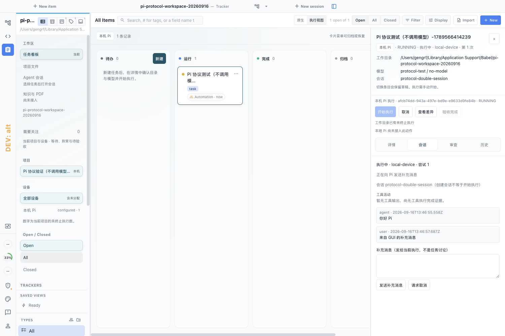
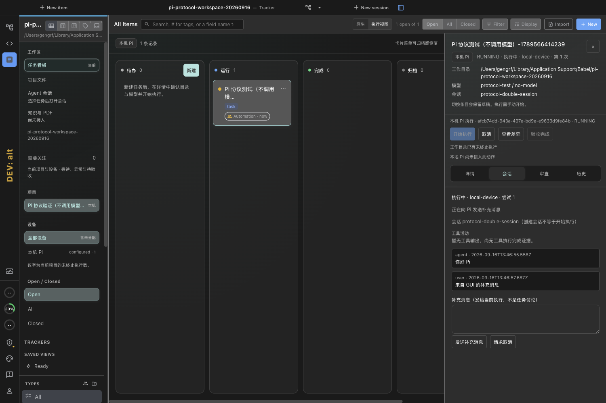

# M1-02b：本地 Pi 任务绑定与三端控制

本片开发完成，独立验收未勾选。Pi 负责模型与工具执行；Babel 负责同一 TrackerRecord 的目录/模型/会话绑定、输出、补充消息和状态。新增 local 模式与独立 profile，演示模式保留。

## 实施与范围

- 基线 `e37b51e`，功能源码提交 `7b24529cbb967dc5e3ac43880d545fc4a601d3ee`；分支 `ui/macos-glass`，工作目录 `/Users/gengrf/Projects/babel`。
- MacBook M3 / arm64 / macOS 27，Node 24.15；专用本地服务、原生 Electron、真实 POSIX PTY、CLI 使用同一 task/run/session。
- GUI/TUI 启动前确认保存的任务版本、工作目录、provider/model；版本或目标变化拒绝提交，相同轮询快照不使确认失效。CLI 要求显式 revision、幂等键和 executionTarget。
- 专用 Pi 配置、隔离 HOME、RPC 消息/工具事件，禁用自动重试；初始 prompt 就绪前不接收补充消息。消息不确定交付保留草稿与相同幂等身份。
- 单 profile 独占写锁、同服务工作目录互斥；重启只恢复记录，非终止 run 标失联，不自动重跑。待审 Pi 仍持有工作目录，不允许归档。
- 本地令牌只由 Electron 主进程读取；IPC 校验调用页面、活动窗口工作区、固定回环地址和项目。HTTP 本地数据接口不允许匿名 demo 身份。
- 停止需 abort 确认及进程组明确消失；EPERM 表示未确认并继续有界观察，持续拒绝则保留状态，不能把权限错误当退出。确认过的 abort 可用于显式清理重试。

## 证据等级

**本次三端使用可控 RPC 子进程替身，不是真实 provider/model 执行。** 配置守卫核实 executable 正是 `tests/fixtures/pi-runtime-double.mjs`，任务标题和证据均标注“不调用模型”。没有读取个人 Pi 凭据，没有调用模型。之前真实 Pi 0.84.1 空配置握手证据仍在相邻 `pi-rpc-20260916`，只算协议预检。

| 检查 | 结果 | 证据 |
|---|---|---|
| 工作区类型检查 | 26 个工作区通过；最后 GUI/运行时修改另做所属包类型检查 | `typecheck-host-final.log`、`typecheck-electron-confirmation.log`、`typecheck-babel-stop-final.log` |
| 宿主完整单测 | 14,211 通过、26 跳过 | `test-host.log` |
| Babel 完整单测 | 361 通过、4 跳过 | `test-babel.log` |
| 完整门禁后的定向修正 | 消息/确认 24、local transport/controls 8、核心 7、最终 runtime 8 通过；不同检查有重叠，不相加成总数 | `focused-confirmation-fixed.log`、`focused-host-final.log`、`focused-archive-guard.log`、`focused-macos-stop-fixed.log` |
| Mac 启动器 | 5 项通过 | `test-launcher.log` |
| 原生三端闭环 | 最终 1 项通过，5.8 秒 | `native-validated.log` |
| 真实 UI/PTY 行为 | GUI 创建/返回确认不启动/确认后启动、GUI 与 TUI 各发一次消息、CLI 读回同 ID、GUI 停止、TUI 恢复备用屏幕 | [身份读回](native-validated/babel-pi-local-native-loca-c7f9d-identity-and-confirmed-stop-electron/pi-protocol-identity.json) |
| 界面 | 原生浅深主题截图已目视检查，日志正文无折射；本轮未重新做完整可访问性/性能验收 | 下方截图 |
| 清理 | 最终测试实例已停止，profile 保留；原演示实例状态另存 | `launcher-cleanup.json`、`original-demo-status.json` |

完整单测运行后新增的消息去重、相同快照确认及 Mac EPERM 修正，已针对变更运行测试和所属包类型检查；没有重复整套测试，也不把旧全量结果冒充逐文件最终快照验证。

## 原生截图

## 已发现并修复的失败

保留 `native-first.log`（测试模块格式）、`native-import-fixed.log`（旧主题 IPC，改用实际主题菜单）、`native-final.log`（同内容轮询使启动确认静默失效）、`native-confirmation-fixed.log`（Mac 退出期间 EPERM）。还修复了初始启动配置把 project 对象传入 runtime、旧宿主 TypeScript lib 不含 AggregateError；没有通过放宽验收断言掩盖问题。历史测试 profile 的未确认记录保留，最终复验使用新专用 profile。

## 尚未完成

真实模型代码任务和工具文件修改验收；真实 Git/Diff/测试证据/PR 交付；每任务 worktree；失联进程接管和自动恢复；实际计划审批、浏览器预览、长日志性能；Windows/Ubuntu 适配回归、VoiceOver/完整响应式及发布签名。local 的 review.accept、review.request_changes、run.respond、run.reconcile、run.retry 暂禁用；停止后可重新经“开始执行”确认创建新 run。待审不是验收通过，停止不是 DONE。

下一步按 TASKS：M1-02c 工作区隔离 → M1-03/03a 真实差异与反馈闭环；真实模型验收另需明确 provider/model/专用 Pi 账号配置范围。
