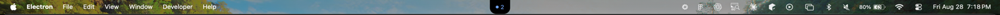
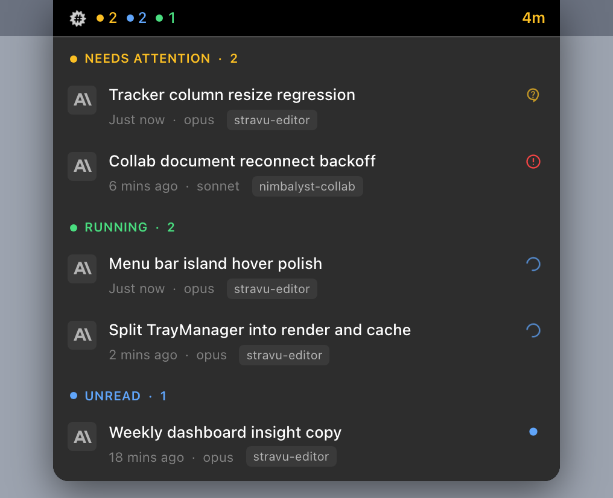
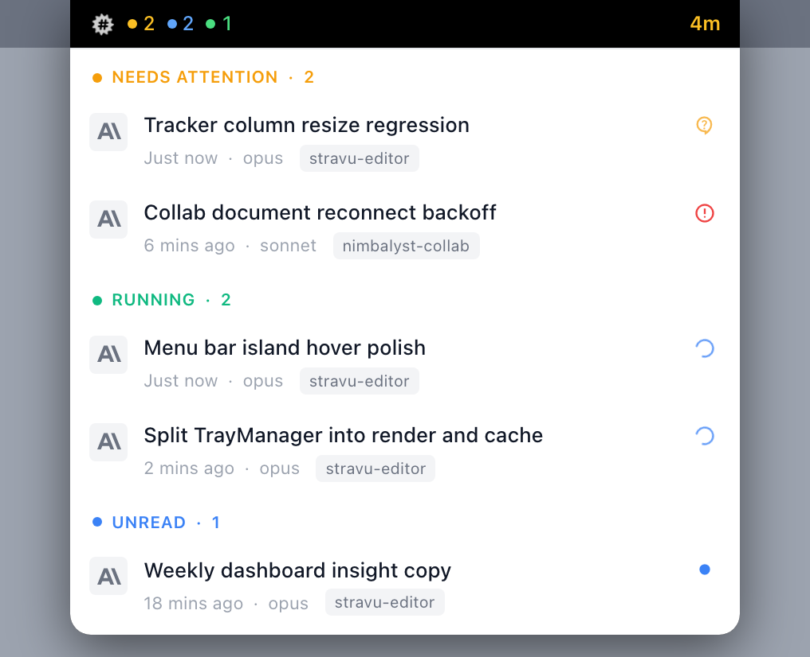
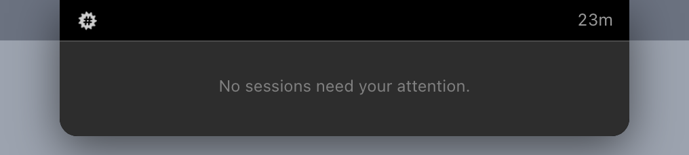

# Menu Bar Island

A live, always-there read on your fleet of AI sessions, drawn inside the macOS menu bar row. It answers "is anything waiting on me?" without a click, names the session at the moment something changes, and expands on hover into the same session rows the in-app popover shows.

macOS only. Windows and Linux keep the existing tray icon and flat session menu.

*The island in a live menu bar, centered on the display, showing two running sessions.*

## Turning it on

Right-click the Nimbalyst tray icon:

- **Show Fleet Status** toggles the strip on and off, independently of the tray icon itself.
- **Fleet Status Style** picks the renderer: **Menu Bar Item** (a bitmap drawn into the tray item, the default) or **Island** (this feature, a floating pill centered in the menu bar).

Both styles are driven by the same state, so switching is purely a change of surface.

## Collapsed states

### Quiet

Nothing running, nothing waiting. The island keeps a minimal presence and shows how long it has been quiet, at minute granularity. This is the difference between *idle* and *broken*, and it costs one short label of width.

The age is the one element that changes without anything actually happening, so it uses tabular figures in a reserved box and never shoves its neighbours as it grows.

### Counts

When the fleet is busy the island shows a dot-and-digit pair per bucket, in a fixed order.

| Color | Meaning |
| --- | --- |
| Amber | Waiting on you (a tool approval or a question/plan decision, counted together) |
| Blue | Running |
| Red | Failed |
| Green | Finished, unread |

Approval and decision collapse into a single amber count at resting width: two near-identical dot-and-digit pairs cost width to say less. The distinction still exists in the data and comes back as a color the moment a session is named.

The age label turns amber when something has been waiting on you for a while.

## Named states

The island widens to name a session at the moment that session's state changes, holds the name for 8 seconds, then settles back to counts. The point of the expansion is that every movement coincides with something that actually happened, rather than a timer rotating names in your peripheral vision.

A name is only news once: a session that has already been announced does not get re-announced while it stays in the same state.

| | |
| --- | --- |
|  | **Amber, needs approval.** A tool permission is pending. |
|  | **Violet, needs a decision.** An AskUserQuestion or plan approval is pending. |
|  | **Red, failed.** The session errored. |
|  | **Blue, started.** A session just began. |
|  | **Green, finished.** A session just completed. |

The dot does work the title cannot: a session name does not tell you whether responding costs three seconds or ten minutes, and the state color does, at zero width.

When several sessions compete for the slot, the most recently changed one wins. Two refinements on top of that:

- A **finished** or **started** name runs out its full hold on the clock, so clicking into a session that just finished does not make the announcement of it disappear at the moment you act on it.
- While an informational name is held, a newer transition only takes the slot if it is at least as urgent. In practice this stops a bare session start from stealing the slot from a session that just finished.

A **waiting** name has no such protection: it drops the instant that session stops waiting, because a name that says a session needs you when it no longer does is worse than no name at all.

## Expanded panel

Hovering the island expands it downward into a panel of live session rows, grouped into Needs attention / Running / Unread. These are the same rows the in-app session popover and the tray panel render, from shared components, so the three surfaces cannot drift apart.

Each row carries the session title, its relative time, the model, the workspace it belongs to, and a status indicator on the right (a question mark when it is waiting on you, an error mark when it failed, a spinner while running, a dot when unread). Clicking a row focuses that session's workspace window and navigates to it.

The panel body follows the app theme; the strip above it is always painted on its own near-black surface with a white foreground in both themes, because the menu bar is translucent and there is no API for its real luminance.

With nothing to show, the panel says so rather than opening empty.

## Interaction model

- **Hover to expand.** Main polls the cursor position at 90ms against the rectangle the renderer reports, with a 260ms exit grace to stop edge flicker. A click-through window stops receiving mouse events the moment the cursor leaves it, so it cannot report its own exit; the poll is what makes hover reliable in both directions.
- **Click the pill to pin.** The panel stays open until dismissed. Pinning makes the window focusable and focuses it, which is the only mechanism that can observe a click landing elsewhere on screen.
- **Three ways out:** click anywhere else (blur), press Escape, or click inside the island's window but outside the panel.
- **Clicks pass through.** At rest the window ignores the mouse and forwards it, so the rest of the menu bar stays clickable underneath the island.
- **It floats over full-screen apps and follows you across Spaces.**

## Known rough edges

- **Placement is centered on the display, and can cover another app's menus.** On a 1352pt built-in display, a centered pill overlaps where an app's menu titles end. Clicks pass through so the menus stay usable, but they are hidden while the island is over them. There is no API for menu extents without an Accessibility grant.
- **It appears in every screenshot and screen share.** There is no quick hide beyond the tray menu toggle today.
- **Dismissing costs a click.** A click beside the open panel dismisses it but is not forwarded to the app underneath. The fix is to size the window to hug the island rather than keeping an oversized transparent canvas.
- **Color vocabulary is not shared between the strip and the panel.** The strip uses blue for running and green for finished; the panel's section headers use green for running and blue for unread. Worth reconciling.
- **Untested:** Stage Manager, menu bar auto-hide, multi-display moves, and long-run stability. Everything above was measured on one machine, macOS 26.5.2 / Electron 43.2.0.

## Where the code lives

| Piece | File |
| --- | --- |
| Fleet derivation (pure) | `packages/electron/src/main/tray/fleetSnapshot.ts` |
| Expand/hold/settle machine (pure) | `packages/electron/src/main/tray/stripStateMachine.ts` |
| Placement and hover hit test (pure) | `packages/electron/src/main/window/islandGeometry.ts` |
| The window, cursor poll and IPC | `packages/electron/src/main/window/MenuBarIslandWindow.ts` |
| Wire contract | `packages/electron/src/shared/menuBarIsland.ts` |
| The renderer | `packages/electron/src/renderer/components/MenuBarIsland/MenuBarIslandApp.tsx` |
| Shared row chrome | `packages/electron/src/renderer/components/TrayPanel/traySessionSections.tsx` |

Design rationale, the measured window recipe, and the spike record are in the plan document for this work.

---

*Screenshots are the shipping component rendered against fixture session data, except the first, which is a live menu bar capture.*
