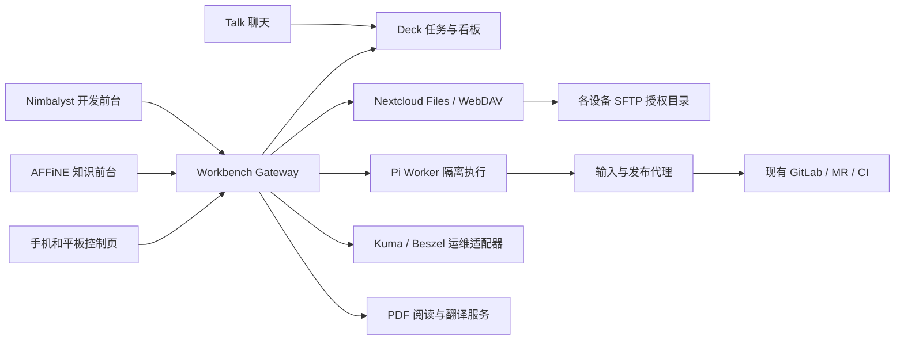
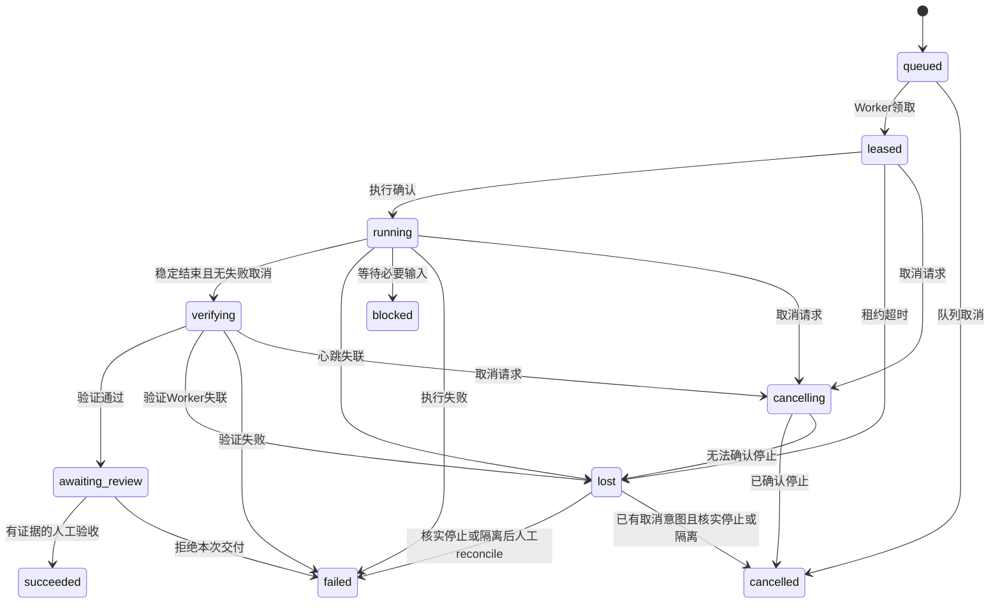

# Personal Workbench 开发规范 v1.0

> 2026-09-14：本文为待迁移的初版基线，不再具备直接实施条件。最新方向是 Nimbalyst 底座、四阶段看板、Google Tasks 与 SSH 设备采集，见 [ADR-003](decisions/ADR-003.md) 和 [系统规格](NIMBALYST-SYSTEM-SPEC.md)。须一致修订本文、OpenAPI、事件及任务清单，不能按下文旧 Talk/Deck 闭环直接开发。

状态：Ready for implementation planning；尚未实现。本文中的 MUST/必须为实现约束，SHOULD/应为默认方案。日期：2026-09-13。

本规范以用户提出的方向为设计前提：保留 Nimbalyst/AFFiNE 的核心界面与能力，通过公共服务连接跨设备文件、聊天任务、Pi 执行、运维和 PDF。它取代前一份“Nextcloud 为唯一前台”的实现假设，不替换现有用户数据。

## 1. 交付物、范围和完成定义

本规范包包括：`README.md`、本文、`contracts/openapi.json`、`contracts/events.schema.json`、`TASKS.md`、`SOURCE-MAP.md`、`PDF-AND-OPS.md`、`decisions/ADR-001.md`、`IMPLEMENTER-PROMPT.md`、`validate-spec.py`。

API/事件契约中的 v1 指首版核心协议；PDF/OPS 子规范中标注 FUTURE 的端点不属于该协议。任何实现不得把后续范围默认为已完成。

### 1.1 用户需求

| ID | 要求 | 首次交付 |
|---|---|---|
| REQ-01 | Windows/Ubuntu/macOS/iOS/iPadOS/Android 访问同一项目、文件和聊天 | R1 文件只读/原生聊天；R3 六端项目操作验收 |
| REQ-02 | 聊天消息形成可追溯任务和看板 | R2：Talk 原生转 Deck 卡片、Gateway 导入 |
| REQ-03 | 任务交给 Pi，在现有开发界面查看多 Agent 状态与交付 | R2 单 Worker；R3 多 Worker、移动端控制 |
| REQ-04 | 经 SSH 访问其他设备授权文件目录 | R1 Ubuntu；R3 Windows/macOS；手机主要为客户端 |
| REQ-05 | 监测 Ubuntu 服务并支持人工诊断/修复 | R3，详见 OPS-* |
| REQ-06 | PDF 批注、原文下插译文、笔记、跨端来源定位 | R4，详见 PDF-* |
| REQ-07 | 最大程度保留 Nimbalyst/AFFiNE UI 与数据能力 | 所有阶段约束 |

R2 是首个可用开发闭环，不代表整体需求完成。整体完成须通过 R1–R4 的验收矩阵，包括手机/平板实机和 PDF 样本；不能只凭构建、模拟浏览器或 HTTP 200 标为完成。

### 1.2 本次不做

- 不重写聊天传输、Git 托管或 AFFiNE CRDT；不整库合并各应用数据库。
- 不复刻 Nimbalyst 商业同步服务器；不承诺 Android 已有 Nimbalyst 成品客户端。
- 不把 iOS/iPadOS 改为整机 SSH 服务器；不执行自动删除文件或自主 root 修复。
- 不把现有研究仓库当破坏性测试目录；不引入 Kubernetes、消息总线集群或多套文件网关。
- 本 spec 是开发计划，不是当前服务器已部署/可用的证明。

## 2. 已决定的技术与组件边界

| 部分 | 决策 |
|---|---|
| 主开发 UI | 现有 Nimbalyst React/Electron；优先使用扩展/Agent adapter，小范围修改宿主边界 |
| 知识 UI | 保留 AFFiNE；只新增关联项目/任务/资源组件，文档继续原同步协议 |
| 人与人聊天 | Nextcloud Talk 原生客户端/网页；不把 Agent session 当多人群聊 |
| 任务权威来源 | Nextcloud Deck：标题、描述、负责人、列和原生讨论 |
| 接入服务 | TypeScript + Node.js LTS + Fastify；以 OpenAPI 3.1/JSON Schema 固定跨端合同 |
| 持久化 | PostgreSQL 独立数据库/账号；队列、幂等记录、outbox 与运行状态同库事务 |
| 文件服务 | 首版 Nextcloud External Storage→SFTP，Gateway 通过受限 WebDAV adapter 读取；不同时部署 SFTPGo |
| 文件受控写入 | 单独的 managed share，由目标机 Worker/文件代理独占写；现有 external share 首版只读 |
| Agent | Pi RPC adapter；版本能力握手，固定上游 SHA/包版本；整个 Worker 受限运行 |
| Git | 现有 GitLab：分支、MR、CI；首版不增加与 Deck 双向同步的 Issues |
| 运行事件 | HTTP worker 上报 + PostgreSQL 持久日志 + SSE 对客户端补取 |
| PDF/运维 | 见 PDF-AND-OPS.md；先确定公共身份和资源引用，再接入 |

M0 必须生成 `versions.lock.json`：每组件记录版本/SHA、许可证、镜像 digest 或包锁、接口探测证据。本文不提供虚假的已锁版本。生产禁止浮动 latest/canary；本地源码快照见 SOURCE-MAP。



图中连线表示逻辑调用关系；Worker实际通过主动领取和心跳获取任务，浏览器不直连SSH。AFFiNE原文档同步保持独立，Gateway仅接收明确授权的引用或快照。

### 2.1 建议仓库结构（待创建）

```text
personal-workbench/
  apps/gateway/             # auth, projects, tasks, resources, runs, outbox
  apps/worker/              # enrollment, lease, Pi adapter, git, managed files
  apps/control-web/         # 手机/平板任务、文件、验收页面
  packages/contracts/      # 本规范契约与生成的客户端类型
  packages/nextcloud/       # LoginFlow, Deck, Talk, WebDAV adapters
  packages/gitlab/          # 项目权限、MR/CI接口
  packages/pi-adapter/      # 固定版本事件归一化
  packages/ui-shared/       # 运行详情等纯展示组件
  integrations/nimbalyst/   # extension、最小宿主补丁、构建清单
  integrations/affine/      # 链接组件和最小补丁，不复制文档后端
  deploy/                  # compose/systemd范例；无真实密钥
  tests/fixtures/           # 合成文件、仓库、上游接口与故障输入
  docs/                    # spec、ADR、runbook、验收证据
```

开发目录建议位于 D 盘新工作目录，实施前确认目标不存在或是预期项目；不要移动现有 Nimbalyst/AFFiNE 安装。源码改动使用独立工作树，保留已有用户修改。

## 3. 身份、权限与登录

### 3.1 登录链路

1. 运维者在配置中登记一个 Nextcloud `integration_id`、固定 HTTPS origin 和允许的回调/出站路径。匿名 API 不接受任意服务器 URL，防止 SSRF。
2. 客户端生成随机 verifier，发送 S256 challenge 给 Gateway 的 `/auth/login-flows`。Gateway 初始化 Nextcloud Login Flow V2，保存其 poll token（密文），只把登录网址/本地 flow ID 给客户端。
3. 用户在系统浏览器授权 Nextcloud。Gateway 是上游 poll 的唯一消费者，遇 404 继续等待；上游 200 只返回一次，必须先把 appPassword 加密持久化，再标记 flow 完成。
4. 客户端用 verifier 调用 `/auth/login-flows/{flow_id}/complete`。未授权返回 202；已完成且 proof 匹配，单次交接 Gateway session。浏览器接收 HttpOnly/Secure/SameSite Cookie；桌面接收 Gateway bearer，存系统密钥库，不给 renderer 暴露 Nextcloud appPassword。
5. 本协议不属于 OAuth/OIDC；challenge/verifier 是自建客户端绑定。Nextcloud 返回的 appPassword 不是 Deck 专属 scope。以 `(integration_id, OCS user id)` 确定 principal，不能按邮箱/显示名自动合并身份。

Flow TTL 20 分钟；本地 session 绝对 TTL 12 小时、空闲 TTL 1 小时，过期重新授权。交接响应丢失时重新创建 flow，不重复返回已交接 bearer。浏览器写操作需 CSRF token 和 origin 检查；SSE 禁止 URL query token。登录流程及密钥不会进入日志/事件/聊天。

### 3.2 授权判定

每次访问取交集：Gateway 项目成员权限 ∩ 当前 Nextcloud 对应 board/card/file 权限 ∩ 远端 OS/共享目录权限。管理员可登记设备，不能自动获得用户项目内容。Gateway 使用对应用户的 delegated credential，不用 Nextcloud admin 账号代替全部用户。

| 角色 | 可读 | 可派发/取消 | 可验收 | 可改设备/项目配置 |
|---|---|---|---|---|
| viewer | 被授权项目资源和运行 | 否 | 否 | 否 |
| developer | 同上 | 是，受项目限制 | 否 | 否 |
| maintainer | 同上 | 是 | 是 | 本项目映射 |
| operator | 仅被另行授权的内容 | 不自动获得 | 不自动获得 | 全局连接、设备和故障配置 |

上游读权限短缓存最长 30 秒；派发、文件写、人工验收等动作必须在线复核，失败则拒绝。项目撤权使新的读写和事件流停止；活跃 run 在下次心跳/写入检查发现后进入取消流程，不能假设撤权可瞬间撤销 Worker 已读出的内容。任务、事件、附件和运行产物都继承所属项目限制。

## 4. 数据所有权与模型

全部内部 ID 为服务生成 UUID；UTC RFC3339 时间；byte/second/token 明确单位。外部 ID 独立字段，不使用带凭据 URL 作为主键。

| 表/聚合 | 关键字段与约束 |
|---|---|
| integrations | id, kind, allowed_origin, secret_ref, capability_version；凭据外置/密文 |
| principals / sessions | integration_id+subject 唯一；session hash、expires_at、revoked_at |
| projects / memberships | project_id, name, deck_board_id, allowed_repository_ids, roles |
| tasks | task_id, project_id, deck_card_id, stack locator, cached fingerprint；(integration_id,card_id) 唯一 |
| resource_links | resource_id, project_id, type, device_id/share_id/path 或 affine_doc_id；不存任意执行命令 |
| specifications | id, task_id, revision, task_fingerprint, immutable snapshot, SHA256；(task_id,revision) 唯一 |
| runs | run_id, task_id, specification_id, state, safety_disposition, holds_task_slot, current_attempt_id；task_id在holds_task_slot=true时唯一 |
| attempts | attempt_id, run_id, worker_id, fence_epoch, lease_expires_at, branch, base_sha, session_ref, exit classification |
| run_events | event_id, run_id, attempt_id, sequence, type, payload；(run_id,sequence) 与 event_id 唯一 |
| artifacts | artifact_id, run_id, type, locator, digest, bytes, sensitivity；同项目权限 |
| workers / capabilities | worker_id, allowed_project_ids, OS/arch、工具版本、隔离类型、最后心跳 |
| device_shares | device_id, share_id, project ACL, external/managed, credential_ref, root mapping |
| idempotency / outbox | principal+method+实际规范化路径+key 唯一、语义请求hash、result；outbox效果键去重 |

所有异步run、operation和outbox还必须持久化 initiated_by_principal_id、delegation_ref、project_id、resource/repository绑定及授权时刻；执行副作用之前重新以原主体在线检查授权。撤权或凭据失效时不能退回共享服务账号继续做用户写入。输入下载、远端写入和GitLab发布同样检查；query/reconcile只能核对旧副作用，不重新授权新写入。

AFFiNE CRDT、Nimbalyst 本地 PGLite、Nextcloud 与 GitLab 数据库不并入 Gateway。Gateway 缓存 Deck 正文只用于显示/审计，并带抓取时间，不能成为另一份独立可编辑的真相。

## 5. 任务流程与并发边界

TASK-01：人在 Talk 使用原生“转 Deck 卡片”，或直接在 Deck 创建。Nimbalyst 共享任务页通过 board 选择/导入关联该卡片。导入相同 card ID 必须返回同一 task ID。

同一卡片返回同一task仅在同一授权项目成立。导入时在线确认card当前board匹配project配置；跨项目已绑定卡片返回409 CARD_PROJECT_MISMATCH，不向无权调用者暴露旧task。原生跨board移动后标记mapping_invalid并禁止派发；operator/maintainer核实项目权限后通过显式迁移流程处理（迁移API不在V1）。

TASK-02：V1 不提供更新 Deck 标题/描述/列的代理 API；界面点击“编辑原任务”跳转 Deck。Deck 的 ETag/If-None-Match 不等于已支持 PUT If-Match CAS。自动运行结果保存在 Gateway 和单独消息/评论，不用旧正文全量 PUT 覆盖卡片。

TASK-03：`POST /tasks/{task_id}/specifications` 接受 expected_task_fingerprint、repository_id、base_ref、goal、acceptance_criteria、context_resource_ids、allowed_paths、worker_requirements。在线读取 Deck，指纹不同返回 409 TASK_CHANGED。解析允许的 GitLab base_ref 为固定 commit SHA，取得明确可读上下文版本，生成不可变 specification。

指纹取 UTF-8 NFC 后规范化 JSON 的 SHA256，字段包括 integration/card ID、标题、正文、来源关联和参与执行的元数据；不使用会被附件/评论改变的上游 ETag 直接代表任务内容版本。代码库和上下文版本纳入 spec_hash。

TASK-04：`POST /runs` 派发时再次读取 Deck/权限，发现 specification 已过期返回 409 SPEC_STALE，要求重新生成。这个比较确定“读取那一刻”的内容，不声称锁住了 Deck 原生编辑。派发之后的原生修改显示“任务有新版”；旧 run 仍使用原快照，由用户决定取消重派。

TASK-05：待验收结果必须关联 base SHA、生成 commit、MR、CI/测试证据和验收说明。`review=accept` 只有 maintainer 可调用；如果项目要求 MR 合并，须核对目标 commit 已合并且指定检查满足。模型文字“完成”不能直接使任务成功。

## 6. Run/Attempt 状态机



RUN-01：Worker heartbeat 每 10 秒；lease 45 秒；事件流与网络请求可能重复/乱序。所有写入必须带 attempt_id、fence_epoch 和 worker token，Gateway 拒绝旧 fence 的事件、产物和状态变更。UI 的 lost 不是 failed/succeeded。

RUN-02：PostgreSQL 事务 + 唯一约束确保单 task 活跃 run。领取使用 `FOR UPDATE SKIP LOCKED` 与 fence 单调递增。lease 过期不直接再发同一工作：先证明旧沙箱/进程已停止，或管理员明确记录隔离处置，再允许创建新 run。Worker 在 lease 无法续约时必须停止进一步写入并终止 Pi 进程树；过期 fence 被拒绝只是服务端保护，不能魔法阻止旧进程对本地磁盘写入。

RUN-03：Worker 在 dispatch 确认后创建独立 clone/worktree 与分支。默认分支 `agent/<task-id>/<attempt-id>`；不得 reset 用户工作树。权限隔离覆盖整个 Pi 进程和扩展；不共享全局凭据、宿主 Docker socket 或任意SSH私钥。

RUN-04：固定 Pi 版本的 adapter 将真实事件归一化。prompt 接受、agent_end 或进程退出都不能单独触发 verifying；以稳定结束信号（当前文档中的 agent_settled）加结果分类决定后续。上下文压缩/自动重试也需纳入状态。

RUN-05：取消先记录 cancelling，通过 heartbeat 响应下发 stop；Worker 先尝试正常中止，10 秒后终止隔离进程树，确认停止才回报 cancelled。无确认进入 lost；不显示虚假已停止。queued 可立即取消。

RUN-06：失败/阻塞/lost 不在原记录覆盖重跑；生成新的 run/attempt，保留 previous_run_id。每次重派重新验证权限/spec freshness。终结 attempt 不接受新的普通事件。

RUN-06A：workflow状态与safety_disposition分开。后者为active/stopping/stopped/isolated/unknown；新queued尚无进程时为stopped。holds_task_slot在queued/leased/running/verifying/awaiting_review/cancelling/lost始终为true；failed/cancelled/blocked只有确认stopped或受审计isolated后才为false，succeeded必须已有停止和交付证据。blocked表示此次执行停止等待新输入，不允许仍运行着旧进程就创建新run。

Worker使用 `/worker/stop-proofs` 提交其本人绑定attempt的停止证据（进程树、停止时间、证据摘要）。过期fence仅允许该接口提交旧attempt停止证据，不续租、不发布、不接受普通事件；未验证的陈述不自动释放slot。`POST /runs/{run_id}/reconcile` 要求项目maintainer和对应device operator能力，引用可检查的停止/隔离证据，记审计后将lost→failed，或取消意图下lost→cancelled，再释放slot。正常current Worker停止确认可由协调器验证处理。DB fencing不能替代进程停止证明。

RUN-07：Pi Worker 默认不直接 push/MR；产物/patch 交 Gateway 发布代理，发布前校验当前 fence。GitLab 写入凭据仅在发布代理中，Agent 不获得主分支合并权限。网络不确定时用确定的分支/attempt标识查询上游，不能重复创建 MR。

RUN-08：Gateway发布/输入代理准备包含固定base SHA的Git bundle和经授权的上下文快照，lease返回input manifest（input ID、类型、SHA256、bytes）。Worker凭自己绑定attempt/fence的token读取 `/worker/attempts/{attempt_id}/inputs/{input_id}`，验证hash后在隔离目录init/fetch bundle/checkout固定SHA；不给Worker通用GitLab token。首版支持无submodule/LFS且≤256MiB的测试仓库bundle；发现未支持依赖须明确UNSUPPORTED_REPOSITORY，不能静默缺文件。Pi模型凭据由受限Worker配置提供，不放lease/事件中。

## 7. 事件、幂等、日志与副作用

EVENT-01：统一 envelope 见 events.schema.json：schema_version、event_id、run_id、attempt_id、server sequence、occurred_at、received_at、type、payload。客户端序号仅作 client_sequence，Gateway 分配全局 run sequence。

EVENT-02：`GET /runs/{run_id}/events` 返回 text/event-stream；id 为已持久化 sequence，断线通过 Last-Event-ID/after_sequence 补取。超出保留窗口返回 410 EVENT_HISTORY_GONE，并提示重新读取 run 快照。15 秒 keepalive，不承载状态伪事件。敏感凭据在落库前过滤，过滤后的文本也只限项目权限。

EVENT-03：每个写 API 要求 Idempotency-Key（UUID），按 principal+method+route 存 7 天。相同 key/body 返回原结果；同 key 不同 body 返回 409 IDEMPOTENCY_CONFLICT；执行中的同 key 返回 409 OPERATION_IN_PROGRESS + Retry-After。事务中保存 mutation+outbox；上游消息按 effect key 去重/重试。超出窗口仍由 card/run/attempt 唯一约束保护关键操作。

此处route是规范化的具体目标路径（含实际resource ID），不是路由模板；请求hash包含规范化body、效果相关query/header（尤其If-Match）。每次返回缓存结果之前先重新授权。同key改变If-Match必须409，不能返回旧前提下的写结果。两个匿名auth/login-flows端点豁免通用幂等规则，采用flow TTL、proof和原子consumed状态；不缓存pending 202。Session transport绑定最初client_kind，browser JSON不含access_token，desktop不混用cookie交接。

EVENT-04：跨服务无法保证真正 exactly-once。Talk 重复通知通过可见 effect marker/本地 outbox防重，未知结果先核对。若上游不能可靠识别旧发送，进入 reconciliation_required，不能无限重试刷屏。

默认保留：完整运行事件30天、脱敏审计90天、运行摘要/交付关联长期；可按项目配置。删除用户内容/产物需另一个明确操作，不能日志轮转时顺带删原件。

## 8. 跨设备文件

FILE-01：设备地址和共享根仅由 operator 登记，返回给UI的是 device/share/resource ID 与显示名称；不存在浏览器任意 `ssh host` 或任意 OS path 参数。Windows/Ubuntu/macOS 是首批被访问端；iOS/iPadOS 为访问端，Android服务端仅后续可选。

FILE-02：external share 经 Nextcloud SFTP 外部存储访问，用户凭据与 Nextcloud 文件权限仍要检查。首版只读：列举、元信息、范围读取、下载。远端编辑后调用显式 refresh，仅表示请求刷新而不是保证所有变更实时出现。状态至少区分 offline、unauthorized、host_key_changed、stale、ready。

FILE-03：managed share 是新建专用目录，由目标机文件代理独占管理，排除用户研究仓库、数据库和系统目录。R1只支持UTF-8小文本创建/更新；创建需非存在，更新需版本匹配，单文件串行锁、临时写和目标机支持的原子替换。`If-Match` 版本只针对该代理控制的版本，不对绕过代理的本地管理员写入提供强保证；检测异常时返回409 EXTERNAL_MODIFICATION并冻结写入。

FILE-04：目录遍历拒绝 `..`、绝对路径、NUL、Windows ADS/UNC/设备保留名；识别盘符大小写、分隔符、Unicode形式及reparse/symlink。目标机打开操作也须验证根范围。首版不跟随链接，只显示不可进入标记；共享根由独立OS权限保证，prefix检查不能取代系统隔离。

FILE-05：文本读取默认上限1MiB，编辑上限512KiB，目录每页100项/最大500项；大文件走有权限的下载流，默认最大1GiB，支持Range，20秒连接超时。没有远程全盘递归搜索；不借索引任务悄悄扫完整磁盘。

FILE-06：UI读取文件要显示设备、版本、抓取时间；网络断开时cached内容明确只读。外部原件编辑留在原生工具或后续明确的checkout/download-copy流程；不能把外部只读模式伪装成可保存。

FILE-07：代码运行与文件浏览不同通道。Pi由项目仓库clone执行，不能把SFTP挂载目录当跨设备共写的Git/SQLite数据目录。远程shell不是通用公开API；任意终端功能不在V1。

FILE-08：managed异步操作先落库并返回operation_id。Gateway通过限定SSH账号的forced-command文件代理（`workbench-file-writer --stdio`，待实现）发送长度有界JSON：protocol_version、operation_id、share_id、relative_path、operation=create/update/query、expected_version、content_base64、sha256。远端以operation_id做持久去重，限制该账号无交互shell/转发并只可写专用根，检查ACL和版本后写入；返回operation_id/status/new_version/content_hash。超时不重新生成ID写第二次，先同ID查询；不确定状态进入reconciliation_required并停止后续同文件写。刷新操作由Nextcloud adapter处理。该私有协议只承担managed目录小文本，不用它向用户开放任意命令。

## 9. Nimbalyst/AFFiNE UI规格

UI-01：Nimbalyst添加“共享项目”入口，保留原本地工作区。页签为任务、运行、资源；沿用现有字体、列表、diff与session展示，不重做全局导航/主题。

UI-02：任务详情显示原Deck来源、最近刷新、spec版本、关联资源、派发按钮、当前run和编辑原任务链接。派发前展示目标仓库/基线/设备/验收摘要。没有配置完整spec时禁止执行并说明缺少字段。

UI-03：运行详情复用可兼容的session UI；provider不可伪装成Claude/Codex，也不能将多个Pi run写进同一聊天session。显示运行阶段、heartbeat、执行设备、工具活动、费用可用性、测试/MR、取消/验收操作。未知费用显示未上报，不填0。

UI-04：文件选择器新增设备级分组、只读/受控写标识和冲突提示；保留本地编辑流程。FileSystemService必须扩展URI、能力检查、失败类型；EditorHost仅负责编辑生命周期，Git和终端不得继续假定所有路径本地。

UI-05：AFFiNE第一阶段只做项目/任务/资源的关联块或链接面板，使用文档ID；不更改CRDT provider。自建Gateway的项目绑定不能自动获得AFFiNE文档权限；导出快照只发生在用户明确选定且有权限的文档上。

UI-06：R3提供响应式control-web，覆盖6平台浏览器的查看/派发/取消/验收。保留原生Talk处理聊天通知。Nimbalyst iOS companion兼容性单独测试；不以已有iOS源码声称Android已经支持。单一原生手机安装包列后续，不作为R3的伪完成项。

## 10. 部署、升级与恢复

- Ubuntu常驻Gateway、数据库、Nextcloud及已有GitLab/MediaWiki；实际主机/端口由M0清单确定，不能照搬旧IP或Windows localhost端口。
- Windows源码/依赖和未来程序默认D盘；Linux数据库使用Linux文件系统，禁止未经核实绑定到WindowsNTFS目录。Ubuntu Agent CPU/内存/并发有限额，默认每Worker并发1，项目并发2。
- HTTP服务经HTTPS反向代理和已验证内网/VPN访问。Worker主动连Gateway，不要求向所有手机开放SSH。服务器指纹变更阻断连接，不静默接受。
- secret_ref对应部署密钥文件/系统密钥库，数据库仅存加密凭据；密钥备份与数据备份分开。程序日志不得包含appPassword、poll token、Pi API key、GitLab token。
- 升级前备份DB+版本清单；迁移使用前向兼容expand/contract，无法兼容则维护窗口。回滚必须恢复相应数据schema或使用已验证兼容版本，不能只降镜像。
- 可用性目标：Gateway重启恢复已持久队列，活跃Worker按lease重新确认；数据库不可用拒绝派发/写入，不使用内存队列继续开发。

## 11. 验收规范

性能指标是目标，不是已测数据。基线：局域网、1个Ubuntu Worker、2个项目、100张卡片、10k事件、目录1k项；记录CPU/RAM/网络、版本和样本。Gateway读API（上游缓存命中）p95<300ms；健康上游下列表操作p95<2s；事件可见延迟p95<2s；重连后不漏已提交事件。慢上游不纳入快API假成绩，单列响应与超时。

| Case | 输入/操作 | 必须观察到 |
|---|---|---|
| ACC-01 | 2个用户、不同Deck/file ACL | 不越权读卡片、run、事件、附件；撤权后写立即拒绝 |
| ACC-02 | 同一card重复导入、重复派发、相同幂等key不同body | 同task/同run或明确409；不能双执行 |
| ACC-03 | 用户在Deck改正文后派发旧spec | SPEC_STALE；旧run留快照、新版提示，不覆盖正文 |
| ACC-04 | Pi agent_end后自动继续；正常稳定结束；进程崩溃 | 不提前验证；分别进入verifying或failed/lost |
| ACC-05 | Worker断网60秒、旧fence继续上报 | lost，旧事件/发布被拒；无自动双重领取 |
| ACC-06 | queued取消、运行取消、取消无ack | cancelled / cancelling→cancelled / lost三种区别 |
| ACC-07 | Gateway重启、SSE断线重连 | committed事件可补取，不重复渲染，不假造进度 |
| ACC-08 | 路径穿越、Windows ADS、链接逃逸、指纹变化 | 拒绝操作且不读取目标根外数据 |
| ACC-09 | external文件保存、managed版本冲突/外部改动 | 前者403；后者409/412，原内容与用户修改可恢复 |
| ACC-10 | 合成Git项目运行任务 | 独立目录、真实测试、MR、人工审核，用户工作区未变 |
| ACC-11 | R2：Talk/Deck来源与Nimbalyst查看同task；R3：AFFiNE链接文档 | R2验任务ID/来源一致；R3再验AFFiNE回链；没有复制运行数据库 |
| ACC-12 | 六平台登录/项目操作/附件访问 | 实机/实际OS逐端记录；不把浏览器设备模拟当实机 |
| ACC-13 | 未知费用/不可量化任务 | 显示未上报/阶段；不填虚假0费用或百分比 |
| ACC-14 | 通知发送超时但上游可能成功 | 进入核对/去重，无循环刷屏或重复MR |
| ACC-15 | PDF/OPS阶段 | 通过子规范全部标为该release必需的验收项 |
| ACC-16 | lost/blocked后重派；旧Worker提交停止证明 | 未核验不释放槽；旧fence仅可提交停止证明；核验后可派新run |
| ACC-17 | 跨项目导入同card；异步队列执行前撤权 | 不返回另一个项目的task；停止未执行副作用，不用管理员凭据兜底 |
| ACC-18 | 同key不同实际路径/If-Match；Cookie/Bearer登录交接 | 路径隔离，内容或If-Match改变返回409；浏览器JSON不泄露Bearer |

验证顺序：schema/静态契约 → 单元状态机与权限 → 假上游故障注入 → 隔离目录与合成Git项目 → 真实服务小样本 → 六平台验收。每个案例保存环境、步骤、日志/截图/断言、结果和未覆盖项，不能以“代码已写”代替通过。

## 12. 参考及证据等级

- 当前代码入口、提交和许可证：SOURCE-MAP.md；只读源码证据不等于运行成功。
- [Nextcloud Login Flow V2](https://docs.nextcloud.com/server/stable/developer_manual/client_apis/LoginFlow/index.html)
- [Deck API及ETag边界](https://deck.readthedocs.io/en/latest/API/)
- [Pi RPC事件](https://github.com/earendil-works/pi/blob/main/packages/coding-agent/docs/rpc.md)
- [Nextcloud SFTP](https://docs.nextcloud.com/server/stable/admin_manual/configuration_files/external_storage/sftp.html)
- [Nimbalyst客户端/协作服务器边界](https://nimbalyst.com/quant/)
- [BlockSuite文档同步](https://blocksuite.io/guide/data-synchronization)

本包应随实现一起修订；修改权威数据源、权限、文件写语义或阶段范围时新增ADR，不能由单个Agent在实现中静默改动架构。
